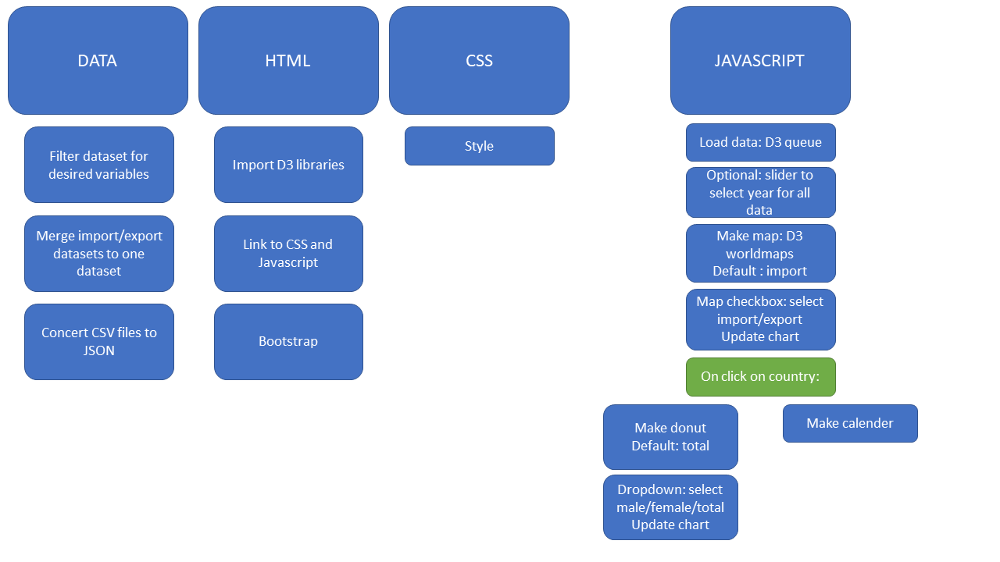

# Design

# Data sources

## Map: import/export
Data on the monthly avocado import and export is available on http://epp.eurostat.ec.europa.eu/. Datasets are available per country per month, I have merged these datasets together in one dataset because I think that is easier to use. The dataset needs to be converted from a CSV to a JSON for use in Javascript.

## Calander view: monthly consumption per person
A countries import - export is used as a measure of avocado consumption as this is the amount of avocados that remains in the country. The dataset used for the map will be used for this part as well. To calculate the consumption per person, a dataset containing the population size of the European country is used. Montly consumption per person is calculated as the following: (import - export) / population size. The dataset needs to be converted from a CSV to a JSON for use in Javascript.
population data: http://appsso.eurostat.ec.europa.eu/nui/show.do?dataset=demo_pjan&lang=en

## Donut chart: health perception per gender
This information is all available in one dataset, it only needs to be converted from a CSV to a JSON.
health perception data: http://stats.oecd.org/#

# Diagram

# Components

# D3 plugins
