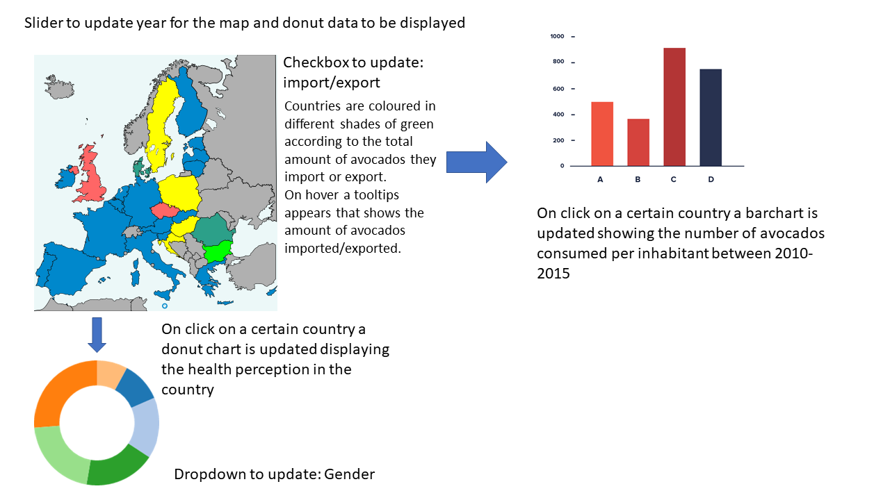

# Project

Dewi Mooij 10752978

[Project](https://DMooij.github.io/programmeerproject/index.html)

# Problem

Since the rise of fitgirls, avocados have become a very popular food. However, the circumstances in Europe are unsuitable for avocado farming, which is why large amounts of avocados are imported throughout the year from avocado producing countries such as Mexico and Peru. As avocados are a superfood and considered to be very healthy, it is interesting to try and find a relation between the amount of avocados imported by a country for consumption and the health perception of its inhabitants.  

This project aims to visualize the amount of avocados imported and exported in Europe throughout multiple years and to explore the connection between the amount of avocados consumed by a countries inhabitants and their health perception.

# Features

The webpage is initialized with a map of Europe. On this map the countries are coloured in different shades of green, reflecting the amount of avocados the country imports/exports (what is shown depends on what is selected from a checkbox). On hovering over a country the exact amount of avocados imported/exported is shown. Besides the map, two other graphs are visible as well being a bar chart and a donut chart. These two graphs are updated when a country on the map is clicked. The barchart shows the consumption of avocados per inhabitant of the selected country in the time period 2010 - 2015. The donut chart shows the health perception indicated as percentage of one of the 3 categories bad/very bad - fair - good/very good. This chart can be updated according to gender using a dropdown menu. Furthermore a slider will be implemented to change the year of the map and the donut chart.

# Sketch

# Data sources

http://madb.europa.eu/madb/statistical_form.htm

http://www.fao.org/faostat/en/#data

http://stats.oecd.org/#

# Libraries

Required libraries are d3-tooltip and d3-worldmaps
