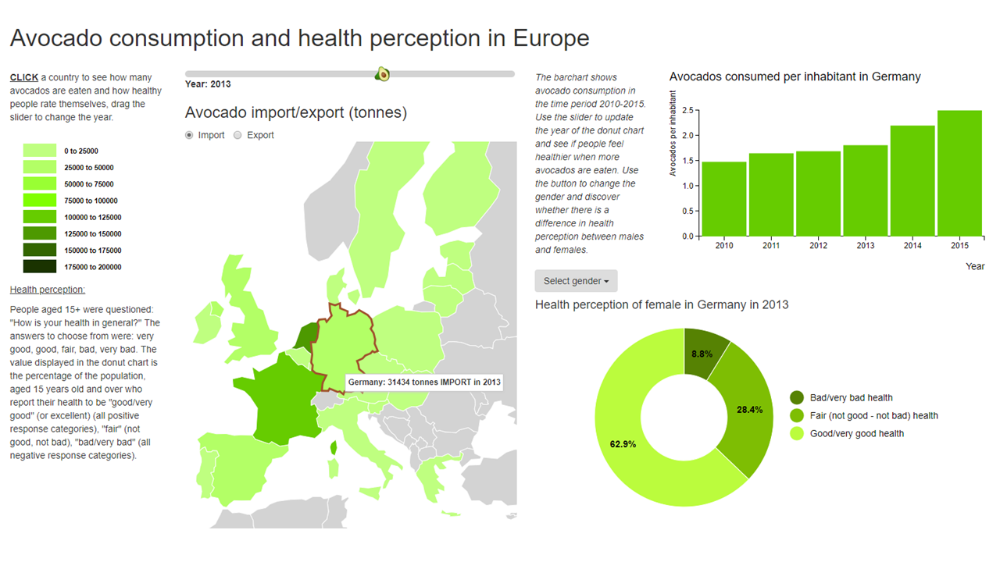

# Report
## Avocado consumption and health perception in Europe

Dewi Mooij 10752978

## Project description

This project aims to visualize the amount of avocados imported and exported in Europe in the time period 2010-2015 and to explore the connection between the amount of avocados consumed by a countries inhabitants and their health perception.

To achieve this goal 3 linked data visualisations are implemented:
- A datamap of Europe. The map shows the amount of avocados imported or exported (depending on what is selected in a checkbox) by the European countries. The year (2010-2015) of the data can be changed with a slider.
- A barchart. The barchart shows the amount of avocados consumed per inhabitant of a selected country in the time period 2010-2015.
- A donut chart. The donut chart shows the health perception of the selected country's inhabitants as a percentage of three different categories. The chart can be updated according to gender with a dropdown menu, also the chart can be updated by year with the slider.

## Project screenshot

## Technical design

All the required data was downloaded as CSV and converted to the JSON format using a converter written in Python. The project code is written in multiple HTML and JavaScript files.

Python:
-CONVERTCSV2JSON.py. Converts CSV to JSON file

HTML:
- index.html. Home page of the website.
- visualisation.html. Page containing the data visualisations.
- sources.html. Page with references to all the used sources.

CSS:
- style.css. Contains css style code for all visualisations.

JavaScript:
- loaddata.js. Load all the data and initialises the default situation of the webpage.
- slider.js. Implement slider functionality.
- map.js. Code to pre-process the map data and to make and update the map.
- donut.js. Code to pre-process the donut data and to make and update the donut chart.
- barchart.js. Code to pre-process the barchart data and to make and update the barchart.

To make the three visualisations, three different datasets were used. In loaddata.js all the datasets are loaded using the queue function and saved as global variables to make them accessible from every file. Furthermore, the default situation for the visualisation is called in loaddata.js by making all three the visualisations and the legend. The defaultslider function is called to enable changing the year for the map and donut chart from the default situation.

Map.js contains functions for pre-processing the data required for the map and for making and updating the map with new data. The dataset for making the map contains data on the amount of avocodos imported and exported per country per year. The function *mapYear()* selects from the dataset the data for the year that has been selected with the slider. Next the function *mapFlow()* is called, this function then sorts the data in an import and export array and makes sure the correct array is used for making the map depending on which flow has been checked in the checkbox. Because I wanted to start the default situation with import, the global variable currentFlow is set to import at the start and later updated when the checkbox selection is changed. From *mapFlow()* the function *mapData()* is called. This function adds the right fillcolor to the countries and converts the data to the format that is required to make the map using d3 worldmaps. Finally, the function *makeMap()* is called which draws the map. When the year or flow is changed, the functions are executed again to select the corresponding data and the previous map is removed by the function removeMap and a map is drawn again by *makeMap()*. *makeMap()* contains the on-click function, on click on a certain country functions for updating the barchart and the donut chart are called as well as the slider function to enable sliding from the new situation. Using d3 worldmaps a hover and tooltip were easily implemented that highlight the country that is being hovered over and show the exact amount imported/exported in the tooltip.

Donut.js contains code for making and updating the donut chart. The dataset used for making the donut contained the health perception data for all three genders for the six years (2010-2015). In loaddata.js *makeDonut()* is called to make the default donut of the gender total in the Netherlands in 2015 and the donut legend. Also *donutData()* is called to allow updating the gender in the default situation. When a country is clicked on the map the donut chart is updated with the data of the selected location. To do this the right data needs to be filtered from the dataset, this is done by selecting data for the correct year and ordering the selected data in three arrays corresponding to the genders. The function *donutGender()* selects the correct array depending on what is selected from the dropdown menu, using the function *donut()* the data is filtered for the correct location and finally the donut is updated using *updateDonut()*. The gender that has been selected from the dropdown is saved in the global variable currentGender and updated when the situation changes. A hover has been implemented that enlarges a slice of the donut on hovering to add some interactivity.

In barchart.js code for making and updating the barchart is written. The required dataset contains the consumption data per country for 6 years. In order to make the correct barchart the right data for the selected country needs to be filtered from the set, this is done using the function *barData()*. In loaddata.js *makeBarchart()* is called making the default barchart of the Netherlands. In map.js the function *updateBarchart()* is called which updates the barchart with data for the country clicked. The barchart also contains a tooltip showing the exact number of avocados consumed.

slider.js includes code for the slider functionality. The function *defaultSlider()* enables changing the year of the map and donut chart for the default situation. The function *slider()* enables sliding from the new situations when a country is clicked on the map.

## Challenges and decisions

The main change from my initial project proposal to the final project is that I have substituted the calendar view for a barchart. As I had the import/export data available per month, I figured it would be nice to make a calender view showing how many avocados are eaten each month. This visualisation would for example show if avocado consumption is season dependent. For this idea I decided to calculate avocado consumption as import - export / inhabitants as this would be the amount of avocados that stays in the country, assumingly for consumption. Initially I also assumed that no avocados were produced in European countries. However, while doing the calculating I found some negative values indicating that some European countries produce avocados after all. To solve this problem I changed the calculation to import + production - export / inhabitants. Unfortunately, the production data was only available per year making it impossible to make the calendar view. Therefore, I decided to make a barchart instead showing yearly avocado consumption with each of the bars representing a year from 2010-2015. In retrospect I find this a better idea than my initial idea because a calendar view would be most spectacular if I had data per day instead of per month which wasn't the case. Also, since I had the health perception data available for the years 2010-2015 it would be nice to implement the slider and make it part of the minimum viable product. By doing so a comparison could be made between the barchart and donut chart that would show if people feel healthier in years when more avocados are consumed.

Making the slider part of the minimum viable product proved to be a little bit difficult because both the map and donut chart that would be updated by the slider already had an update themselves, being the flow for the map and the gender for the donut chart. Making the slider work for just one flow or gender wasn't too difficult. The hard part was that when for instance I changed the flow on the map from import to export and then used the slider the year would change but the data would go back to import. For the donut I found the same problem; updating the gender from total to female and then sliding would change the year correctly but also turn the gender back to total. The solution to the problem was that I needed to store the currentFlow and currentGender in global variables and update these when the flow or gender was changed. To make the webpage look more appealing I made the slider icon an avocado.

Initially I had coded the map legend in such a way that it would find the maximum and minimum value of the selected flow and year and make the legend accordingly. However, with the slider it would then change the legend for every year and flow, making it very difficult to compare the situations on map color. Therefore I decided to hardcode the legend so it would change on updating the map, enabling comparisons between years and flows.

Reflecting on my code I found that I have a lot of nested functions which is not very nice. One of the reasons for this is that I decided to implement the slider before improving the quality of my code because I think the slider adds a lot to the page and makes it much more interesting because comparisons between years can now be made and one can actually find out if people feel healthier in years when more avocados are eaten. Also in some countries the barchart really shows an increase in avocado consumption, which I think relates to the increased popularity of the avocado since it was first called a superfood and fitgirls started eating it so much. In a perfect world I would have liked to fix my code to avoid the nesting, unfortunately I did not have time to do this now.
